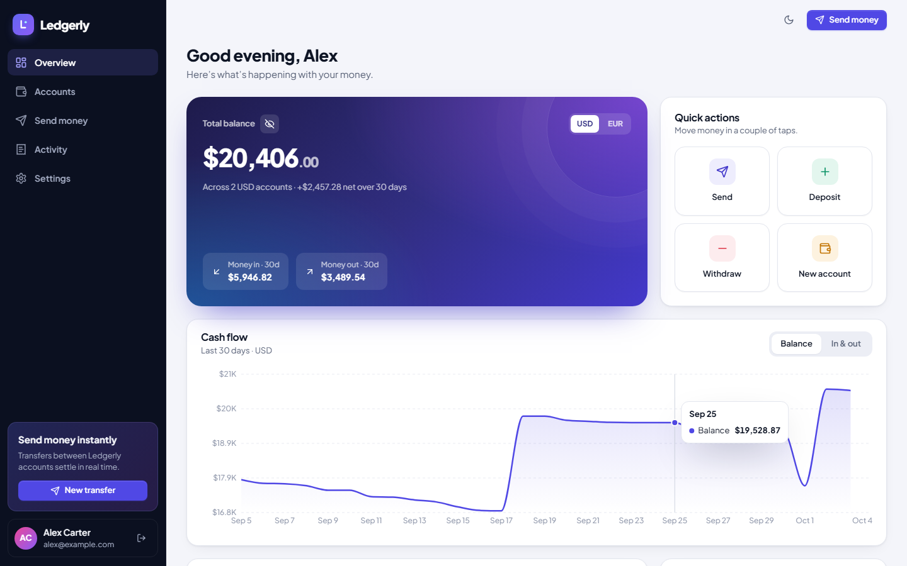
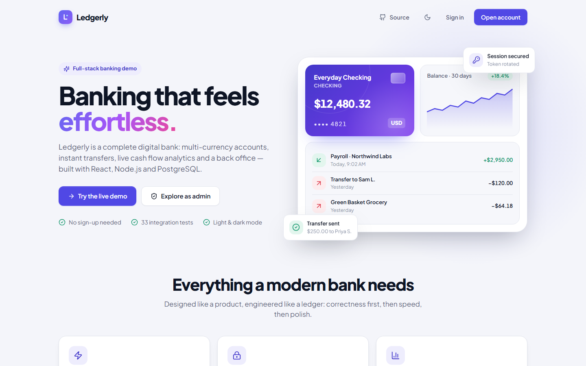
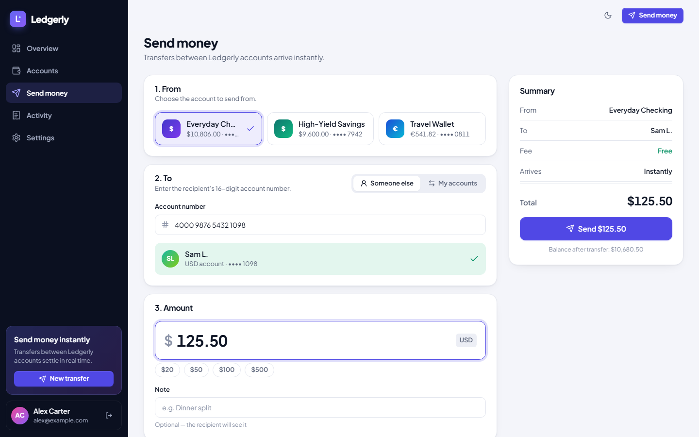
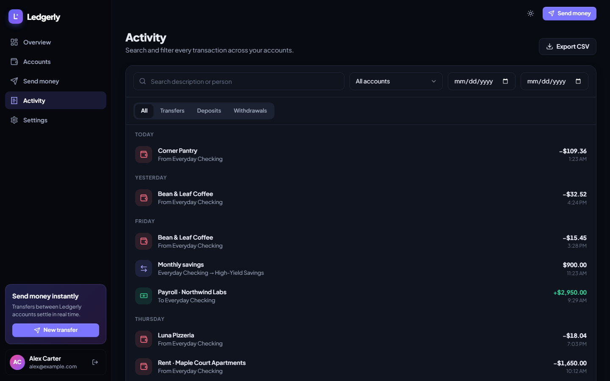
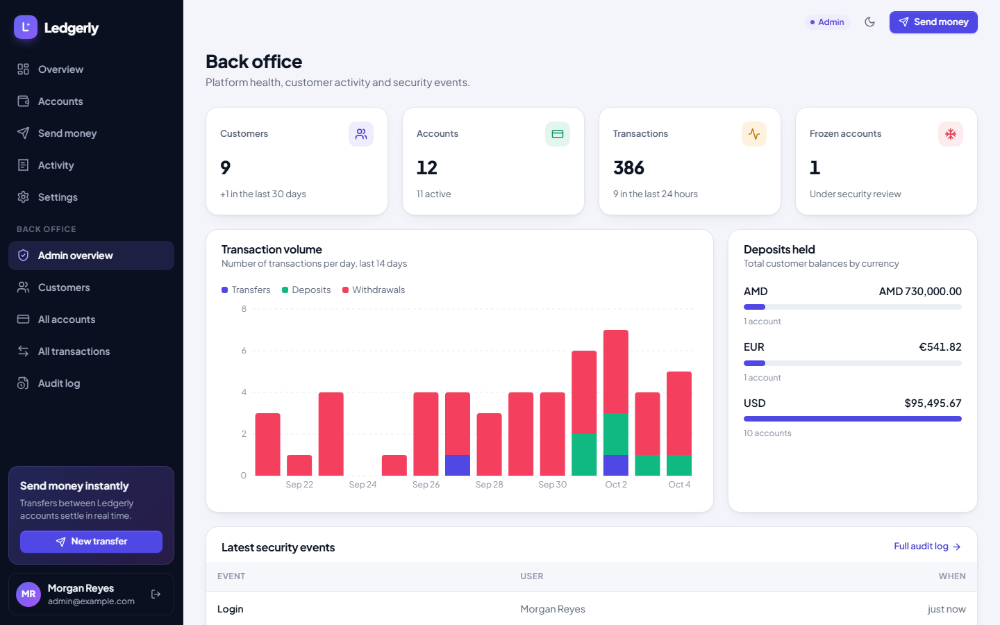
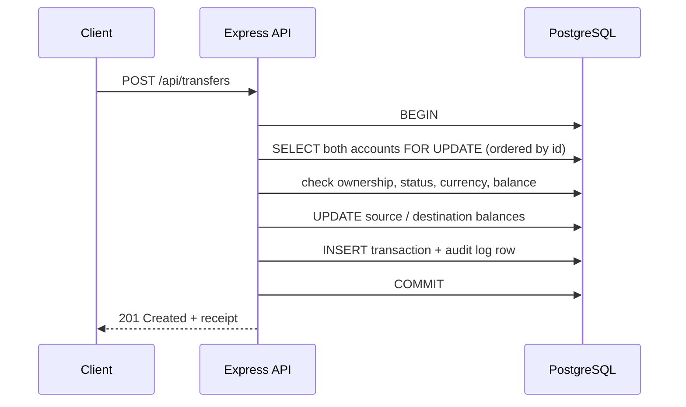
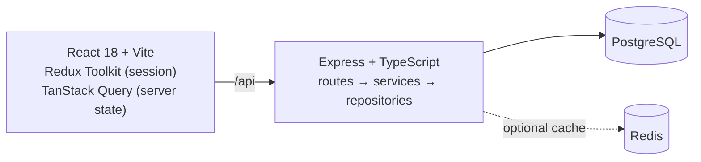
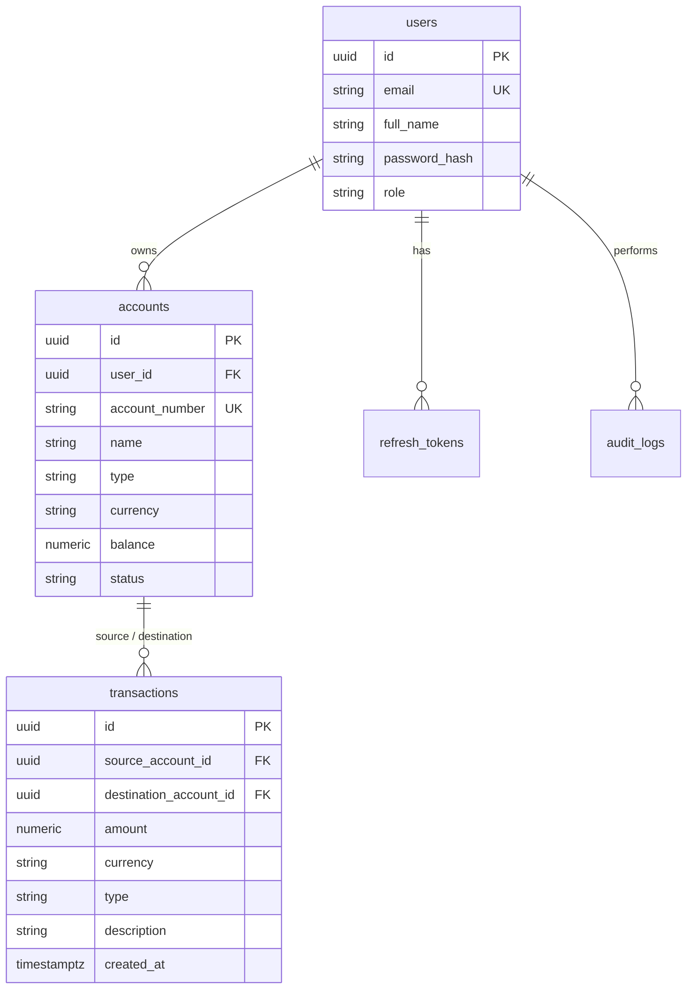

# Ledgerly — full-stack digital banking

Ledgerly is a complete banking web app: multi-currency accounts, instant transfers between customers, cash flow analytics, and a back office for administrators. It is built with **React + TypeScript** on the front end and **Node.js, Express and PostgreSQL** on the back end.

The focus is on financial correctness: money is never stored as floating point, every transfer is atomic, and concurrent requests can never overdraw an account. Integration tests against a real database prove all three.



> This is a portfolio project. No real money is involved.

## Try it

After starting the app (see [Run it locally](#run-it-locally)), open it and click **Try the live demo**, or sign in with one of these accounts:

| Role     | Email               | Password      | What to look at                                 |
| -------- | ------------------- | ------------- | ----------------------------------------------- |
| Customer | `alex@example.com`  | `password123` | 3 accounts and 4 months of realistic history    |
| Customer | `sam@example.com`   | `password123` | USD and AMD accounts; sends money to Alex       |
| Admin    | `admin@example.com` | `password123` | Back office: metrics, freezing, audit log       |

New sign-ups get a checking account with $1,000 of demo money, so transfers can be tried right away.

## Features

**For customers**
- Dashboard with total balance per currency, 30-day money in / money out, and a balance history chart
- Checking and savings accounts in USD, EUR and AMD, each with a 16-digit account number
- Send money to your own accounts or to anyone by account number, with a live recipient lookup ("Sam L.")
- Deposits and withdrawals (simulated cash), with overdraft protection
- Activity feed grouped by day, with search, filters by type, account and date range, receipts, and CSV export
- Rename or close accounts, edit your profile, change your password (signs out other sessions)
- Light and dark mode, and a responsive layout down to phone width

**For administrators**
- Platform metrics: customers, accounts, 14-day transaction volume, and deposits held per currency
- Search every customer, account and transaction; promote or demote admins
- Freeze and unfreeze accounts with a reason; frozen accounts can't move money
- An append-only audit log of sign-ins, failed sign-ins, money movement and admin actions

| | |
| --- | --- |
|  |  |
|  |  |

## Engineering highlights

**Exact money.** Balances are `NUMERIC(18,2)` in PostgreSQL and integer cents in JavaScript ([`utils/money.ts`](backend/src/utils/money.ts)). Balance updates run in SQL (`balance = balance + $1`), so `0.10 + 0.20` is always `0.30`.

**Atomic, concurrency-safe transfers.** A transfer runs in one database transaction ([`accountService.transfer`](backend/src/services/accountService.ts)):



- Row locks (`SELECT … FOR UPDATE`) make concurrent transfers queue up instead of reading stale balances. A test fires 12 parallel $100 transfers at a $1,000 account: exactly 10 succeed and the balance ends at $0.00.
- Both rows are always locked in id order, so two customers sending to each other at the same moment can't deadlock. This is also tested.
- The audit row is written with the same database client, so it commits or rolls back together with the money.

**Secure sessions.**
- Access tokens are 15-minute JWTs, pinned to the HS256 algorithm.
- Refresh tokens are random 384-bit strings; only their SHA-256 digest is stored.
- Refresh tokens rotate on every use. Reusing an old token revokes every session of that user.
- Passwords are hashed with bcrypt, and sign-in takes the same time whether or not the email exists.
- Sign-in is rate limited, and Helmet sets security headers.
- On the client, parallel requests that hit an expired token wait for a single shared refresh ([`lib/api.ts`](frontend/src/lib/api.ts)).

**Privacy by default.**
- Customers asking for another customer's account get a 404, not a 403, so account ids don't leak.
- Transfers show the counterparty's name and only the last four digits of their account number.
- Admin endpoints never return password hashes.

**Analytics in SQL.** The cash flow chart uses one `generate_series` query for daily income and expense. Internal moves between a customer's own accounts are excluded. The balance history is rebuilt backwards from today's balance ([`transactionRepository.cashflow`](backend/src/repositories/transactionRepository.ts)).

**Operational details.**
- Versioned migrations run on startup, each in its own transaction under a transaction-scoped advisory lock, so they are safe with several instances and behind connection poolers.
- Validation errors from Zod become readable `400` responses with per-field errors.
- Redis caches account reads (cache-aside) and is optional: the app runs fine without it.
- The server shuts down gracefully. `/health` is a cheap liveness check that never touches the database; `/health/ready` also checks the database.
- An optional demo reset (`DEMO_RESET_HOURS`) stores its last run in the database, so it keeps its schedule even on hosts that put idle servers to sleep.

## Architecture



```
backend/src
├── routes/         HTTP layer: Zod validation, response envelopes
├── services/       business rules: auth, money movement, admin
├── repositories/   SQL, one file per table, DTO mapping
├── db/             pool, migrations, demo data seed, Redis
├── middleware/     auth (JWT, roles), error handling
└── tests/          integration tests (Vitest + Supertest + real PostgreSQL)

frontend/src
├── pages/          routes, including admin/ (lazy loaded)
├── components/     design system (ui.tsx, Modal, Toast) and banking widgets
├── lib/            API client with token refresh, queries, formatting
└── styles/         CSS variables, light and dark themes
```

### Data model



## API

All endpoints live under `/api`. They return `{ success, data }`, and list endpoints add `meta: { page, pageSize, total, totalPages }`.

| Area         | Endpoints |
| ------------ | --------- |
| Auth         | `POST /auth/register` · `POST /auth/login` · `POST /auth/refresh` · `POST /auth/logout` · `GET/PATCH /auth/me` · `POST /auth/change-password` |
| Accounts     | `GET/POST /accounts` · `GET/PATCH /accounts/:id` · `POST /accounts/:id/deposit` · `POST /accounts/:id/withdraw` · `POST /accounts/:id/close` · `GET /accounts/lookup?number=` |
| Transfers    | `POST /transfers` (to `destinationAccountId` or `destinationAccountNumber`) |
| Transactions | `GET /transactions?type&accountId&search&from&to&page` · `GET /transactions/:id` · `GET /transactions/cashflow?currency&days` |
| Admin        | `GET /admin/stats` · `GET /admin/users` · `PATCH /admin/users/:id/role` · `GET /admin/accounts` · `PATCH /admin/accounts/:id/status` · `GET /admin/transactions` · `GET /admin/audit-logs` |

## Run it locally

### With Docker (recommended)

```bash
docker compose up --build
```

Then open http://localhost:5173. PostgreSQL, Redis, the API (hot reload) and the Vite dev server all start; migrations run and demo data is seeded automatically.

### Without Docker

You need Node.js 20+ and PostgreSQL 13+.

```bash
npm install
cp .env.example backend/.env      # then set DATABASE_URL
npm run dev:backend               # API on http://localhost:4000 (migrates + seeds on start)
npm run dev:frontend              # app on http://localhost:5173, proxies /api to the API
```

Useful scripts:

```bash
npm test             # integration tests (set TEST_DATABASE_URL to an empty database)
npm run lint
npm run typecheck
npm run build
npm run seed:reset   # wipe the database and load the demo data again
```

## Deploy

The root [`Dockerfile`](Dockerfile) builds a single production image: the API also serves the compiled React app, so one service and one database are all you need.

### Free: Render + Neon

1. Create a free [Neon](https://neon.com) project in the **AWS Europe Central 1 (Frankfurt)** region and copy its connection string.
2. In [Render](https://render.com), choose **New → Blueprint**, connect this repository, and paste the Neon connection string as `DATABASE_URL`. [`render.yaml`](render.yaml) sets up the rest: a free Docker web service in Frankfurt, a generated JWT secret, and demo data that resets every 24 hours.
3. On first start the API creates the tables and loads the demo data.

Render's own free databases are deleted 30 days after creation, which is why the database lives on Neon.

Free Render web services sleep after 15 minutes without visitors, and the next visit takes about a minute. To avoid that, point a free uptime monitor (for example [UptimeRobot](https://uptimerobot.com)) at `https://<your-app>.onrender.com/health` every 5 minutes. That route doesn't query the database, so Neon can still sleep when idle and stays within its free compute hours.

### Anywhere else

Run the image with `DATABASE_URL` and `JWT_ACCESS_SECRET` set. Add `DATABASE_SSL=true` if your database requires TLS and its connection string doesn't already ask for it (Neon's does). See [`.env.example`](.env.example) for every option.

CI ([`.github/workflows/ci.yml`](.github/workflows/ci.yml)) runs lint, type checks, the integration tests against PostgreSQL, and the production build on every push.

## Limitations

- Deposits and withdrawals are simulated; there is no card network or payment provider.
- Currency exchange isn't supported, so transfers require matching currencies.
- There's no email verification, 2FA or fraud scoring. These would be next on the list.
