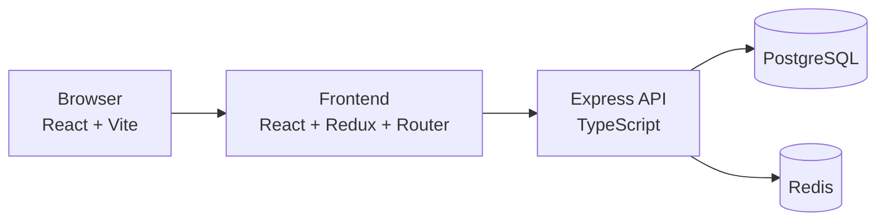
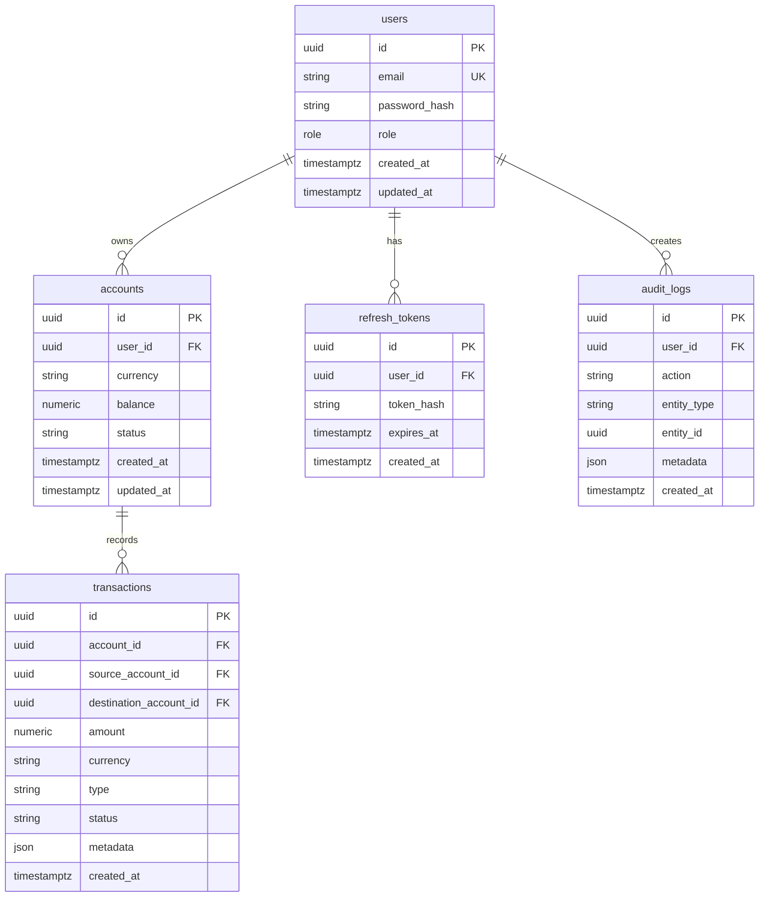
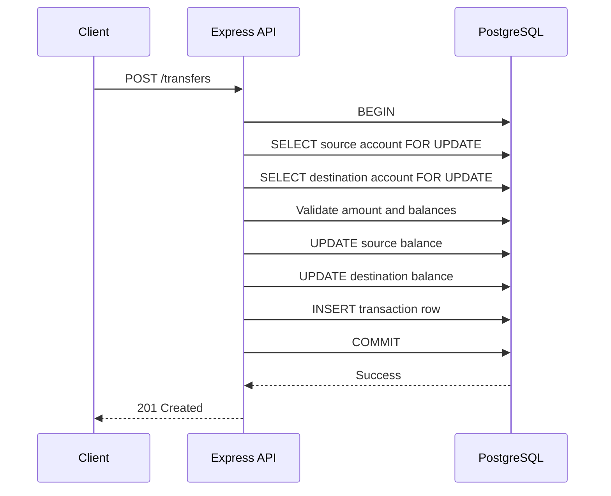

# Banking System Portfolio Project

## Overview

This project is a full-stack banking system designed as a portfolio and interview-ready application. It aims to demonstrate practical backend engineering skill, correct financial logic, concurrency handling, secure authentication, and a clean full-stack architecture.

This is not a real production banking system and should not be treated as such. It is intentionally built as a realistic engineering exercise.

## Features

- User registration, login, refresh, logout
- JWT authentication with bcrypt password hashing
- Role-based access control for customers and administrators
- Multiple accounts per user with currency support
- Deposits and withdrawals with validation
- Account-to-account transfers with PostgreSQL transactions
- Transaction history with filtering and pagination
- Redis cache-aside for account reads
- Audit log tracking for important events
- Admin dashboards for users, accounts, transactions, and audit logs
- Docker Compose setup for local development
- Environment-variable-based configuration for deployment

## Architecture



## Technology Stack

### Frontend
- React
- TypeScript
- Vite
- Redux Toolkit
- React Router

### Backend
- Node.js
- Express
- TypeScript
- PostgreSQL
- Redis
- JWT
- bcrypt
- zod or express-validator style validation

### Infrastructure
- Docker
- Docker Compose
- git-based CI workflow

## Database Schema



## API Structure

### Auth
- `POST /auth/register`
- `POST /auth/login`
- `POST /auth/refresh`
- `POST /auth/logout`

### Accounts
- `GET /accounts`
- `GET /accounts/:id`
- `POST /accounts`
- `GET /accounts/:id/balance`
- `POST /accounts/:id/deposit`
- `POST /accounts/:id/withdraw`

### Transfers
- `POST /transfers`

### Admin
- `GET /admin/users`
- `GET /admin/accounts`
- `GET /admin/transactions`
- `GET /admin/audit-logs`

## Authentication Flow

1. User registers with email and password.
2. Password is hashed with bcrypt.
3. Backend issues an access token and refresh token.
4. Access token is used for protected requests.
5. Refresh token is used to obtain a new access token.
6. Logout invalidates the refresh token and clears session state.

## Transfer Transaction Flow



## Concurrency Handling

The banking transfer flow relies on PostgreSQL row-level locking via `SELECT ... FOR UPDATE` for the source and destination accounts before any balance update. This prevents race conditions where two concurrent withdrawals or transfers observe stale balances.

Locking order is kept consistent for cross-account operations to reduce deadlock risk. The transfer logic must never perform a transfer without a single database transaction.

## Redis Caching Strategy

- Cache account details and balances with TTL
- Use a cache-aside pattern: check Redis first, fallback to Postgres, then populate cache
- Invalidate or refresh cache after deposit, withdrawal, transfer, and account updates
- Redis is optional for the application to function; the app must degrade gracefully when it is unavailable

## Docker Setup

```bash
docker compose up --build
```

This starts:
- frontend on `http://localhost:5173`
- backend on `http://localhost:4000`
- PostgreSQL on `localhost:15432`
- Redis on `localhost:6380`

## Environment Variables

See `.env.example` for the required values.

## Testing

The project includes automated tests covering:
- registration
- login
- authorization
- account creation
- deposit
- withdraw
- transfer
- insufficient balance
- same-account transfer
- currency mismatch
- concurrent operations
- rollback behavior

## Deployment

This project is designed for environment-variable-based deployment. A typical free-tier design is:

- Frontend: Vercel
- Backend: Render
- PostgreSQL: Neon or Supabase
- Redis: Upstash

Implementation does not hardcode provider-specific assumptions.

## Limitations

- This is a portfolio demo, not a bank-grade production system.
- Currency conversion is not implemented.
- Real financial compliance, fraud detection, and audit-depth controls are intentionally out of scope.

## Future Improvements

- Multi-currency accounts with FX conversion
- Transaction notifications
- WebSocket activity feed
- Better admin analytics
- SSO and MFA
- Advanced fraud monitoring

## Local Development

1. Copy `.env.example` to `.env`
2. Run `docker compose up --build`
3. Access the app at `http://localhost:5173`

## Notes

The codebase has been intentionally kept understandable and production-like without overengineering. The primary goal is correctness, security, and interview-friendly architecture.
